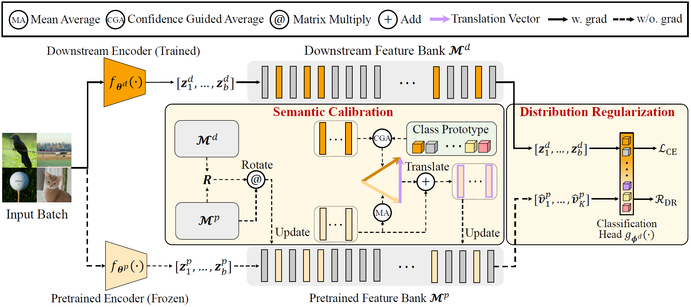

# DR-Tune


[https://arxiv.org/abs/2308.12058](https://arxiv.org/abs/2308.12058)

This repository is an official PyTorch implementation of DR-Tune: Improving Fine-tuning of Pretrained Visual Models by Distribution Regularization with Semantic Calibration (ICCV2023).




## Usage

### Environments

* python 3.9.7
* pytorch 1.13.1
* torchvision 0.14.1
* GPU NVIDIA GeForce RTX 2080 Ti

### Dataset preparation

The datasets used in Table 1 can be downloaded via their official link. 

The datasets used in Table 2 can be downloaded from [here](https://github.com/dongzelian/SSF) and see "vtab-1k". 


### Pretrained model preparation

The pretrained model checkpoints used in the paper can be found in the table below. 

Please put the checkpoint in ```  ./pretrained_models```.

| Backbone architecture | Pretraining strategy |                             Url                              |
| --------------------- | -------------------- | :----------------------------------------------------------: |
| ViT-B                 | Classification       | [Checkpoint](https://storage.googleapis.com/vit_models/imagenet21k/ViT-B_16.npz) |
| ViT-B                 | MAE                  | [Checkpoint](https://dl.fbaipublicfiles.com/mae/pretrain/mae_pretrain_vit_base.pth) |
| ViT-L                 | MAE                  | [Checkpoint](https://dl.fbaipublicfiles.com/mae/pretrain/mae_pretrain_vit_large.pth) |
| ResNet-50             | MoCo-v1              | [Checkpoint](https://dl.fbaipublicfiles.com/moco/moco_checkpoints/moco_v1_200ep/moco_v1_200ep_pretrain.pth.tar) |
| ResNet-50             | MoCo-v2              | [Checkpoint](https://dl.fbaipublicfiles.com/moco/moco_checkpoints/moco_v2_800ep/moco_v2_800ep_pretrain.pth.tar) |
| ResNet-50             | PCL                  | [Checkpoint](https://storage.googleapis.com/sfr-pcl-data-research/PCL_checkpoint/PCL_v2_epoch200.pth.tar) |
| ResNet-50             | HCSC                 | [Checkpoint](https://hcscpretrained.s3.us-east-2.amazonaws.com/hcsc_800eps.pth) |
| ResNet-50             | SwAV                 | [Checkpoint](https://dl.fbaipublicfiles.com/deepcluster/swav_800ep_pretrain.pth.tar) |
| ResNet-50/101/152     | InfoMin              | [Checkpoint](https://github.com/HobbitLong/PyContrast/blob/master/pycontrast/docs/MODEL_ZOO.md) |
| ResNeXt-101/152       | InfoMin              | [Checkpoint](https://github.com/HobbitLong/PyContrast/blob/master/pycontrast/docs/MODEL_ZOO.md) |


## Training

Fine-tuning a ResNet-50 pretrained by MoCo-v2 on CIFAR10. 

CIFAR10 will be automatically downloaded to ```  ./data```.

```
bash train.sh 1 --cfg ./configs/cifar10_k2048_lr001.yaml
```

## Citation
If you find our work helpful in your research, please cite it as:

```
@article{zhou2023dr,
  title={DR-Tune: Improving Fine-tuning of Pretrained Visual Models by Distribution Regularization with Semantic Calibration},
  author={Zhou, Nan and Chen, Jiaxin and Huang, Di},
  journal={arXiv preprint arXiv:2308.12058},
  year={2023}
}
```
